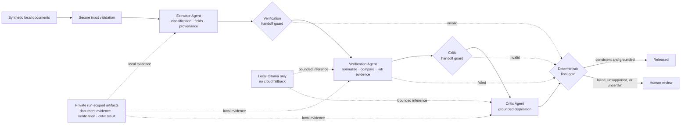

# Multi-Agent Financial Document Reviewer

This repository contains intentionally small slices of a local-first financial-document review workflow. The Extractor Agent supports three known synthetic templates—pay stub, W-2, and bank statement—with deterministic classification, label/value extraction, code-owned provenance, schema validation, evidence validation, and a fail-closed release decision. A higher-level LangGraph reviews a pay-stub/W-2 pair, runs both deterministic handoff assemblers, invokes the bounded Verification and Critic Agents, and applies a code-owned final gate. Only a consistent, grounded review result is released downstream; this is not credit, claim, or other financial approval.

See the concise [architecture overview](docs/architecture/architecture.md) for
the system flow, trust boundaries, state separation, and agent responsibilities.

## Architecture at a glance



Agents produce bounded findings; the deterministic final gate is the only
component allowed to release a result. Sensitive evidence remains in local,
run-scoped artifacts rather than callback-visible LangGraph state.

## Compiled LangGraph views

These diagrams show the application nodes and conditional routes compiled from
the implemented workflows. The complete explanation is in the
[architecture overview](docs/architecture/architecture.md).

### Main orchestrator

[](docs/architecture/graphs/main-orchestrator.svg)

### Extractor Agent

[](docs/architecture/graphs/extractor-agent.svg)

### Verification Agent

[](docs/architecture/graphs/verification-agent.svg)

The Critic Agent is a bounded node in the main orchestrator; it does not own a
separate internal LangGraph.

## Security boundary

- Only explicitly marked synthetic UTF-8 `.txt` documents are accepted.
- Document bytes remain in a permission-restricted local store.
- Agent 1's pay-stub, W-2, and bank-statement paths make no model call. The multi-agent income-review path uses only the guarded loopback Ollama adapter for Agents 2 and 3, with no cloud fallback.
- Raw document text, model output, extracted values, and local correlation/document IDs never enter callback-visible LangGraph state.
- Logs and local JSONL audit records accept only closed, typed operational metadata.
- One random review trace links preflight, intake, storage, Agent 1 graph nodes,
  and the final decision. Completed spans contain only closed stages, outcomes,
  timings, document classifications, and sanitized cause codes.
- Trace handles and identifiers stay outside LangGraph state, model context,
  audit metadata, and public review outcomes.
- Ambient LangSmith/LangChain tracing, collectors, debug, and verbose callbacks fail closed.
- The future LangSmith sink is disabled by type and receives no local identifiers.
- A missing, duplicate, conflicting, empty, malformed, or unverifiable field routes to human review; it cannot cross the release envelope.
- Bank-statement extraction is limited to the declared statement fields and monthly-deposit total; transaction analysis and spending categorization are out of scope.

This milestone is for synthetic development documents only. Do not submit real customer, account, or employee data.

## Setup and verification

Python 3.11+ and `uv` are the supported path:

```bash
uv sync --frozen
uv run pytest -q
```

`pyproject.toml` and `uv.lock` are canonical. This standalone project does not
include cloud-inference SDKs or dependencies from the older reference
experiments. The LangSmith package is used only to detect and reject active
tracing contexts; telemetry export remains disabled.

## Local run

Ollama does not need to be running for the current extraction workflow because all three approved templates are deterministic. Local-model settings are still validated at startup so a future selective model route cannot quietly introduce a cloud endpoint or fallback.

```python
from pathlib import Path

from financial_reviewer.foundation.config import LocalModelSettings
from financial_reviewer.foundation.intake import DocumentSubmission
from financial_reviewer.workflow import DocumentExtractionReviewer

payload = Path("tests/fixtures/synthetic_pay_stub.txt").read_bytes()
reviewer = DocumentExtractionReviewer.local(
    Path(".local/financial_reviewer"),
    settings=LocalModelSettings.from_environment(),
)
outcome = reviewer.review(
    DocumentSubmission(
        filename="synthetic_pay_stub.txt",
        content_type="text/plain",
        content=payload,
        declared_synthetic=True,
    )
)
print(outcome.status, outcome.failure_code)
```

Accepted local-model configuration is deliberately narrow: `FINANCIAL_REVIEWER_OLLAMA_BASE_URL`, `FINANCIAL_REVIEWER_OLLAMA_MODEL`, `FINANCIAL_REVIEWER_OLLAMA_ALLOWED_MODELS`, deterministic generation/resource limits, and `FINANCIAL_REVIEWER_ALLOW_CLOUD_FALLBACK=false`. `.env` files are not loaded by the reviewer.

The graph nodes are `classify → deterministic_extract → schema_validate → evidence_guard → finalize`. There is no loop, retry edge, tool call, or LLM node in this slice. The longest successful path executes five application nodes; LangGraph also has a separate recursion safety limit of eight supersteps.

The higher-level income-review graph is `extract_documents → verification_input_assemble → verification → critic_input_assemble → critic → final_gate`, with fail-closed conditional routes to the final gate. The Verification Agent owns a separate five-node LangGraph—`validate_request`, `model_decision`, `decision_guard`, `execute_tool`, and `finalize`—so its bounded model/tool loop is explicit and testable.

Every call to `review()` now creates one vendor-neutral parent/child trace:

```text
financial.review
├── runtime.preflight
├── input.validation
├── document.storage
├── telemetry.policy
├── agent.evidence_extraction
│   ├── classification
│   ├── extract
│   ├── schema_validation
│   ├── evidence_guard
│   └── finalize
└── review.final_decision
```

The default trace sink validates this structure and exports nothing. An
explicit `LocalOtlpTraceSink` maps the same closed spans to OTLP protobuf and
accepts only a literal loopback `/v1/traces` endpoint. It performs no automatic
instrumentation, retry, cloud routing, or fallback.

## Optional local Traceboard projection

Start Traceboard locally, then set the exact approved exporter configuration:

```bash
export OTEL_EXPORTER_OTLP_ENDPOINT=http://127.0.0.1:4318
export OTEL_EXPORTER_OTLP_PROTOCOL=http/protobuf
export OTEL_SERVICE_NAME=multi-agent-financial-document-reviewer
export OTEL_RESOURCE_ATTRIBUTES=traceboard.project.id=multi-agent-financial-document-reviewer
```

Opt in explicitly when constructing the complete reviewer:

```python
from pathlib import Path

from financial_reviewer.foundation.config import LocalModelSettings
from financial_reviewer.local.otlp_trace import (
    LocalOtlpTraceSettings,
    LocalOtlpTraceSink,
)
from financial_reviewer.orchestration.income_review import IncomeReviewOrchestrator

trace_sink = LocalOtlpTraceSink(
    LocalOtlpTraceSettings.from_environment()
)
reviewer = IncomeReviewOrchestrator.local(
    Path(".local/financial_reviewer"),
    settings=LocalModelSettings.from_environment(),
    trace_sink=trace_sink,
)
```

One multi-agent review now creates one random root trace. Bundle validation,
all six orchestration nodes, and both documents' existing Extractor spans share
that trace ID through private parent/child handles. A successful synthetic
paystub/W-2 review produces 30 sanitized spans. Trace identifiers and handles
never enter LangGraph state, model context, audit metadata, or public outcomes.

Only constant resource names, random trace/span identifiers, closed stage and
outcome names, safe document classifications, durations, and allowlisted cause
codes are transmitted. The adapter never includes document text, extracted
values, prompts, model output, local audit identifiers, or exception messages.
Traceboard forwarding remains a separate explicit Traceboard-process setting;
the reviewer does not construct a LangSmith client. A typed local exporter
failure is counted by the private trace session but does not change the review
outcome; mandatory local audit behavior remains independent.

State sharing is split deliberately:

- `WorkflowState` contains only callback-safe control flags, classification, and PII-free unresolved reason codes.
- `_RunArtifacts` holds document text, extracted values, and provenance locally outside callback-visible graph state and deletes them after the run.
- The higher-level `IncomeReviewState` likewise carries only readiness flags,
  closed statuses/reasons, and bounded counts. `_IncomeReviewArtifacts` privately
  holds both handoff requests and Agent 2/3 results for one invocation.

## Verification handoff and deferred bank flow

`VerificationInputAssembler` accepts exactly one evidence-guarded pay stub and
one evidence-guarded W-2. It maps monthly income plus pay-period year and annual
wages plus tax year into Agent 2's typed request. It makes no model or tool call,
and it preserves each document's independent year and provenance.

Bank statements deliberately fail this first handoff. `Monthly Deposits` is not
equivalent to verified payroll income because it may include transfers, refunds,
or other deposits. A later increment can connect this planned bank flow:
identify payroll transactions with evidence → normalize verified payroll income
→ compare with pay stub/W-2 → send the findings to the Critic Agent.

## Code navigation

Start at `financial_reviewer/workflow.py` for one-document extraction or
`financial_reviewer/orchestration/income_review.py` for the multi-agent flow.
The package is grouped by responsibility:

```text
financial_reviewer/
├── workflow.py
├── orchestration/
│   └── income_review.py
├── foundation/
│   ├── config.py
│   ├── handoffs.py
│   ├── intake.py
│   └── schemas.py
├── agents/
│   ├── agent1_extraction.py
│   ├── agent2_verification.py
│   └── agent3_critic.py
└── local/
    ├── model.py
    ├── storage.py
    ├── observability.py
    └── telemetry.py
```

`agent1_extraction.py` supplies the document-specific extraction behavior.
`foundation/handoffs.py` contains the independently tested Agent 1 → Agent 2
and amount-free Agent 2 → Critic input assemblers. `orchestration/income_review.py` connects two Agent 1 reviews to the
bounded Agent 2 and Agent 3 nodes, then applies the deterministic release table.
`agent3_critic.py` contains the two-attempt Critic decision boundary; it cannot
release an outcome itself.
