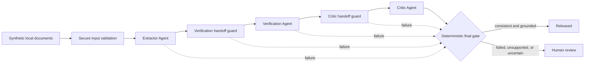
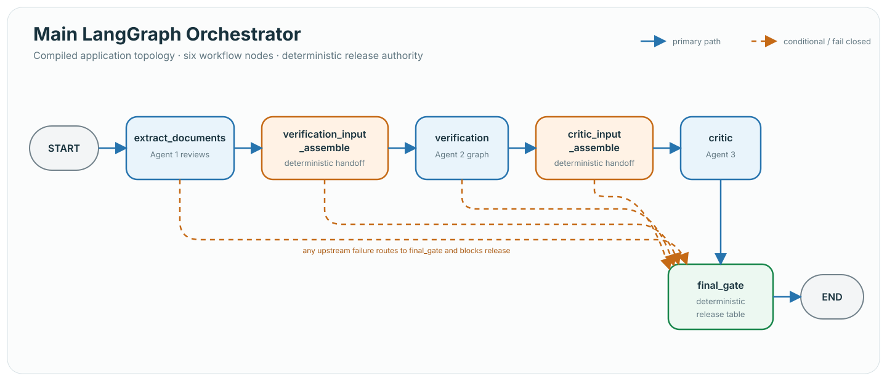
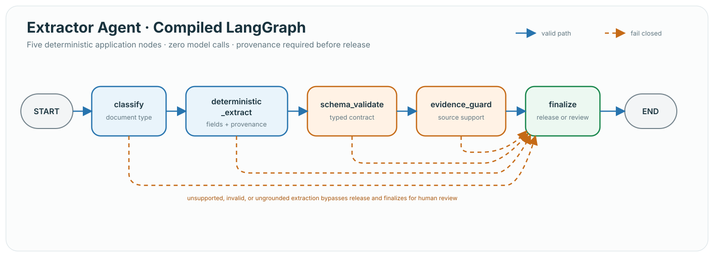
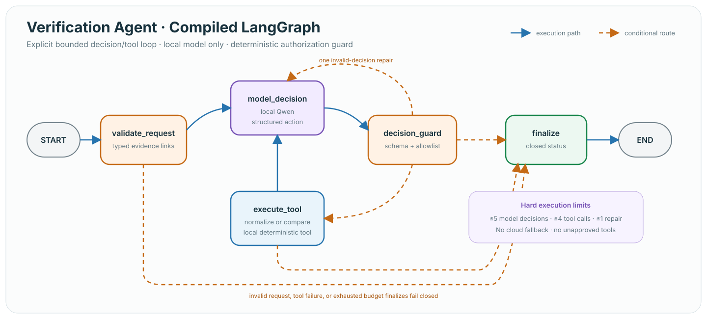

# Multi-Agent Financial Document Reviewer — Architecture

## Scope

This project reviews synthetic local financial documents and releases only a
validated, evidence-grounded review result. It does not approve credit, claims,
or other financial decisions. Document content and PII remain local, and model
inference is restricted to loopback Ollama with no cloud fallback.

## High-level flow



The final gate is the only release authority. Agents produce bounded findings;
they cannot release a result directly.

## Compiled LangGraph views

These topology images are derived from the compiled graphs exercised by the
synthetic workflow tests. Solid lines show the primary execution path; dashed
lines show conditional, repair, or fail-closed routing.

### Main orchestrator



### Extractor Agent



### Verification Agent



The Critic Agent is intentionally not shown as a separate compiled graph. It is
a bounded node in the main orchestrator and does not own an internal LangGraph.

## Workflow boundaries

| Component | Responsibility | Control model |
| --- | --- | --- |
| Secure intake | Validate synthetic marker, type, size, and encoding | Deterministic |
| Extractor Agent | Classify and extract fields with source provenance | Five-node deterministic LangGraph |
| Verification handoff | Assemble an evidence-guarded pay-stub/W-2 request | Deterministic |
| Verification Agent | Normalize and compare income evidence | Bounded five-node LangGraph with local tools |
| Critic handoff | Link the verification result to supporting evidence | Deterministic |
| Critic Agent | Challenge the result and return a grounded disposition | Bounded local model call; no tools |
| Final gate | Apply the release decision table | Deterministic, fail closed |

## State and sensitive artifacts

LangGraph state carries only callback-safe control information: opaque run
tokens, readiness flags, bounded counters, closed statuses, and cause codes.
Document text, extracted values, provenance, model decisions, handoff requests,
and agent results remain in private run-scoped artifact maps. Those artifacts
are removed on every terminal path.

This separation prevents sensitive financial content from entering graph
callbacks, logs, traces, or routing state.

## Agent limits

- Extractor: no model calls, tools, or retries.
- Verification: at most five model decisions, four local tool calls, and one
  invalid-decision retry.
- Critic: at most one initial decision and one schema-repair attempt; no tools.
- Orchestrator: six application nodes with conditional failure routes to the
  final gate.

## Local trust boundary

- Only synthetic UTF-8 text fixtures are accepted in this increment.
- Documents are stored in an owner-restricted local directory.
- Ollama endpoints must resolve to loopback and the model must be allowlisted.
- Cloud fallback and ambient cloud tracing fail closed.
- Logs, audit records, and optional OTLP spans contain only sanitized,
  allowlisted operational metadata.

## Code navigation

```text
financial_reviewer/
├── workflow.py                     # Secure single-document review facade
├── orchestration/income_review.py # Multi-agent orchestration and final gate
├── agents/
│   ├── agent1_extraction.py        # Deterministic extraction behavior
│   ├── agent2_verification.py      # Bounded verification loop and local tools
│   └── agent3_critic.py            # Bounded critic decision boundary
├── foundation/                    # Schemas, intake, configuration, handoffs
└── local/                         # Model, storage, audit, and trace adapters
```

The test suite uses only synthetic documents and covers each agent contract,
handoff boundary, failure route, release rule, and observability safety policy.
